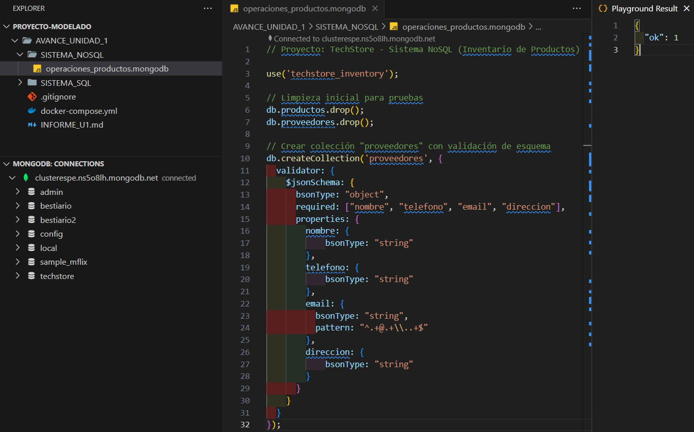
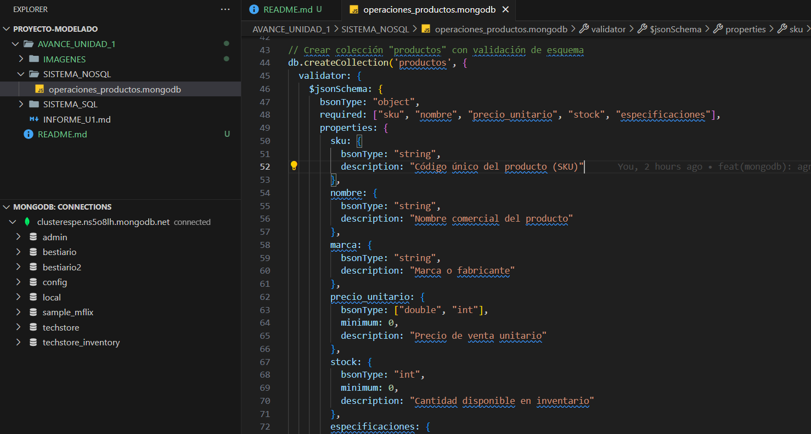
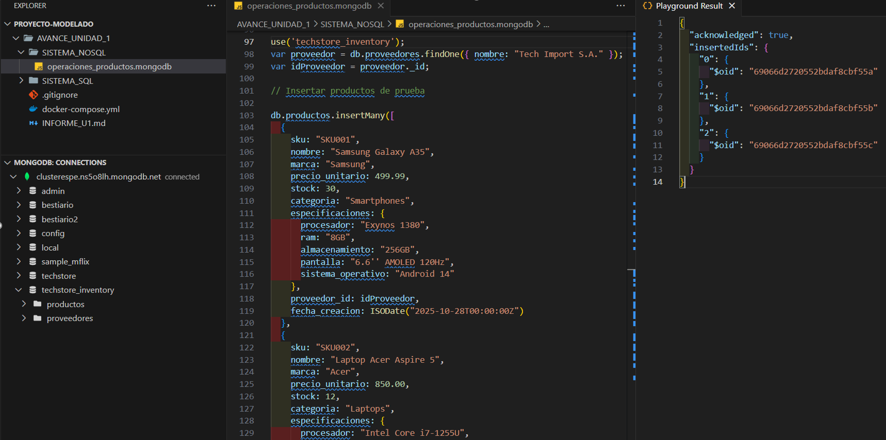
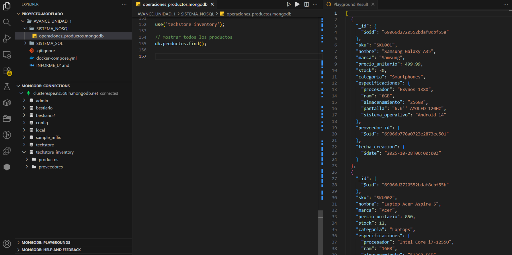
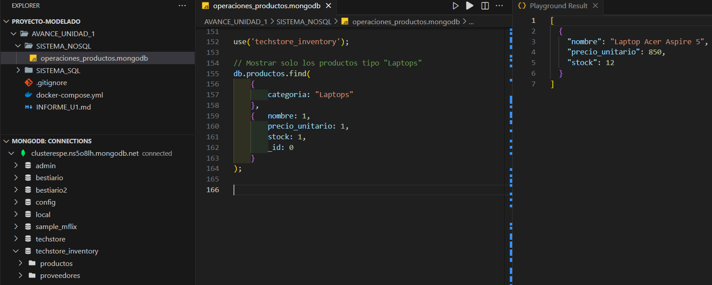
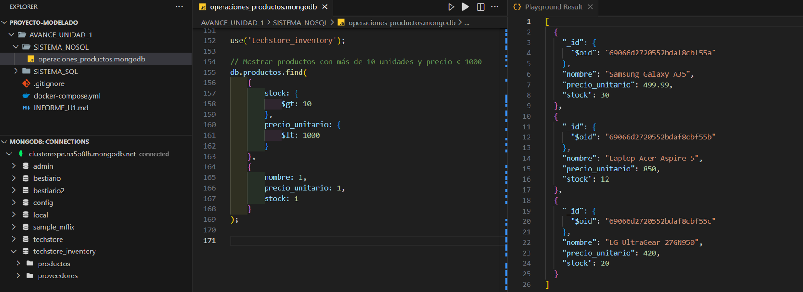
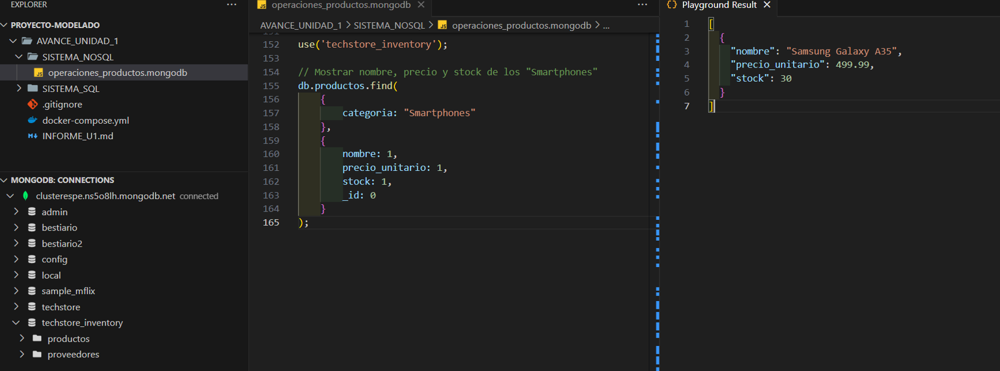
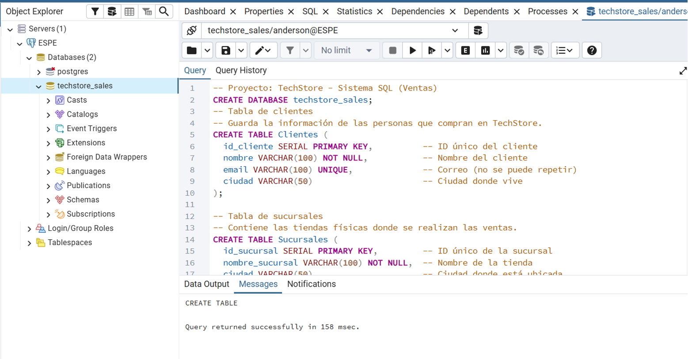

# Proyecto Macro: Solución de Business Intelligence para "TechStore"

**Autor:** Lara Chicaiza Anderson Lenin  
**Asignatura:** Modelado Avanzado de Base de Datos – 6to ITIN   
**Institución:** Universidad de las Fuerzas Armadas ESPE  

---

## Contexto General

**TechStore** es una cadena minorista de tecnología que ha crecido rápidamente. Actualmente, sus datos se encuentran distribuidos en diferentes sistemas:

- **Base de Datos Relacional (SQL):** utilizada para transacciones de ventas, clientes y sucursales.  
- **Base de Datos NoSQL (MongoDB):** utilizada para manejar inventario y productos con atributos variables.

---

## Objetivo del Proyecto

Construir un **Data Mart de Ventas** que integre las fuentes de datos **SQL y NoSQL**, permitiendo generar **inteligencia de negocio** a partir de sistemas operacionales (OLTP).

El **Avance 1** se centra en modelar y analizar los **sistemas fuente**, asegurando la calidad de los datos que luego serán utilizados en las etapas analíticas (OLAP).

---

## Desarrollo

### 1. Sistema NoSQL (MongoDB) – Catálogo de Productos

Se creó la base de datos **`techstore_inventory`** en **MongoDB Atlas** y se implementó la colección **`proveedores`** con validación de esquema mediante **`$jsonSchema`**, asegurando que los campos **`nombre`**, **`telefono`**, **`email`** y **`direccion`** cumplan con el formato establecido. Tras limpiar colecciones previas, se recreó la colección e insertaron registros validados correctamente. En la **imagen inferior** se observa la ejecución del script y la confirmación del sistema con el mensaje `"ok": 1`.



Se creó la colección **`productos`** en la base **`techstore_inventory`**, aplicando validaciones con **`$jsonSchema`** para asegurar la calidad y consistencia de los datos. El esquema define campos obligatorios como **`sku`**, **`nombre`**, **`marca`**, **`precio_unitario`**, **`stock`** y **`especificaciones`**. 



Se extrajo el **_id** del proveedor **"Tech Import S.A."** desde la colección **`proveedores`** y se utilizó como referencia en la colección **`productos`** para mantener la relación entre ambas entidades. Posteriormente, se insertaron varios documentos de productos de prueba, cada uno con sus especificaciones técnicas y campos validados.



Se listaron todos los documentos almacenados en la colección **`productos`** de la base **`techstore_inventory`**. La consulta mostró correctamente los registros insertados, incluyendo sus campos validados, especificaciones técnicas y la referencia al **_id** del proveedor asociado. 



Se ejecutó una consulta filtrada en la colección **`productos`** para listar únicamente los registros pertenecientes a la categoría **"Laptops"**. 



Se realizó una consulta por rangos en la colección **`productos`** para listar únicamente aquellos con **más de 10 unidades en stock** y un **precio unitario menor a 1000**. 



Se ejecutó una consulta en la colección **`productos`** para mostrar únicamente los campos **`nombre`**, **`precio_unitario`** y **`stock`** de los documentos pertenecientes a la categoría **"Smartphones"**.



Se creó un **índice único** sobre el campo **`sku`**. Este índice garantiza que cada producto tenga un **código SKU irrepetible**, evitando duplicidades en los registros y reforzando la integridad de los datos dentro del inventario. 


Se creó la base de datos **`techstore_sales`** en el sistema **PostgreSQL**. En esta fase se generaron las tablas **`Clientes`** y **`Sucursales`**, incluyendo sus claves primarias, restricciones de unicidad y tipos de datos correspondientes. Cada tabla fue diseñada para asegurar la integridad y consistencia de la información, siguiendo el modelo lógico planteado. 



---

### 2. Sistema Relacional (PostgreSQL) – Transacciones de Ventas

Se elaboró el **modelo Entidad–Relación (DER)** para la base de datos **`techstore_sales`** en draw.io, representando la estructura del sistema transaccional de ventas. El modelo define las entidades principales **Clientes**, **Sucursales**, **Ventas** y **Detalle_Ventas**, junto con sus atributos y relaciones cardinales.  


---

## Estructura del Repositorio

```bash
TechStore-U1-OLTP/
├── 📁 sql/
│   ├── schema_ventas.sql
│   └── modelo_relacional_ventas.png
├── 📁 nosql/
│   └── operaciones_productos.mongodb
├── 📁 docs/
│   └── INFORME_U1.md
└── README.md
```

